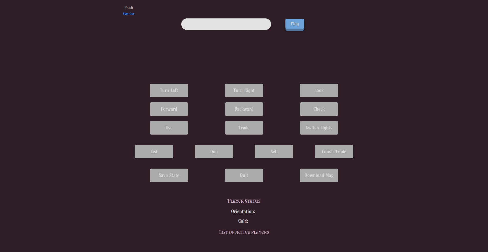

# System Design

## Introduction
This rendition of the World Navigator game is made web-based, online, and between multiple people. 
In theory, there is no limit to the number of players, since the map is generated on the fly when the match is started.
This version also includes a website with a MongoDB database that stores the users' login information.

## Front-End
When navigating to the game website, you are greeted with a login/sign-up form.
After you sign-up and login, you are redirected to the match page. 
You click `play` to register the user in a match. 
When the button is clicked again (now displays `ready` instead of `play`), then the client notifies the server that the player is ready to play. 
When all players are ready, the map is generated, and the match is started.

The JavaScript in the website has several responsibilities:
* Opens the WebSocket and communicates with the server.
* Sends user requests in an appropriate format.
* Dynamically loads content to display to user.
* Requests an updated Player Status when a command that modifies the status is sent.
* Permits only valid operations to be executed.
* Listens to all the click events for all buttons and items.

Sign-up and login process:


Here are a few screenshots in different stages of the game:

Figure 1 - Landing Page:


Figure 2 - Game Started:


Figure 3 - Trading:


Figure 4 - Looting a Chest:


<br/>
Here is a scenario for a fight between two players (notice how the player list changes):

Figure 5 - Start of Fight:


Figure 6 - Winning a Fight


<br/>

Figure 7: Multiple Players in the Same Match


<br/>

An example of a `Download Map` command with 1 player in a 3x3 grid:
```Json
{
  "rooms": [
    {
      "east": {
        "locked": false,
        "mapSite": "Door",
        "roomID": 1,
        "otherRoomID": 2,
        "key": "Lich Ornament"
      },
      "south": {
        "locked": false,
        "mapSite": "Door",
        "roomID": 1,
        "otherRoomID": 4,
        "key": "Sunshard"
      },
      "lightswitch": {
        "hasLights": true,
        "lightsOn": true
      },
      "north": {
        "hiddenKey": "",
        "mapSite": "Painting"
      },
      "west": {
        "hiddenKey": "Sunshard",
        "mapSite": "Painting"
      },
      "id": 1
    },
    {
      "east": {
        "hiddenKey": "Lich Ornament",
        "mapSite": "Mirror"
      },
      "south": {
        "locked": true,
        "mapSite": "Door",
        "roomID": 2,
        "otherRoomID": 5,
        "key": "Lich Ornament"
      },
      "lightswitch": {
        "hasLights": true,
        "lightsOn": false
      },
      "north": {
        "hiddenKey": "Lich Ornament",
        "mapSite": "Painting"
      },
      "west": {
        "locked": false,
        "mapSite": "Door",
        "roomID": 2,
        "otherRoomID": 1,
        "key": "Lich Ornament"
      },
      "id": 2
    },
    {
      "east": {
        "hiddenKey": "Lich Ornament",
        "mapSite": "Mirror"
      },
      "south": {
        "hiddenKey": "Lich Ornament",
        "mapSite": "Painting"
      },
      "lightswitch": {
        "hasLights": true,
        "lightsOn": false
      },
      "north": {
        "locked": false,
        "mapSite": "Door",
        "roomID": 4,
        "otherRoomID": 1,
        "key": "Sunshard"
      },
      "west": {
        "loot": {
          "gold": 0,
          "items": []
        },
        "locked": true,
        "mapSite": "Chest",
        "key": "Sunshard"
      },
      "id": 4
    },
    {
      "east": {
        "locked": false,
        "mapSite": "Door",
        "roomID": 5,
        "otherRoomID": 9,
        "key": "Desolation Harp"
      },
      "south": {
        "hiddenKey": "",
        "mapSite": "Painting"
      },
      "lightswitch": {
        "hasLights": true,
        "lightsOn": false
      },
      "north": {
        "locked": true,
        "mapSite": "Door",
        "roomID": 5,
        "otherRoomID": 2,
        "key": "Lich Ornament"
      },
      "west": {
        "mapSite": "Seller",
        "items": [
          {
            "name": "Desolation Harp",
            "type": "Key"
          },
          {
            "name": "Lich Ornament",
            "type": "Key"
          },
          {
            "name": "Flashlight",
            "type": "Flashlight"
          }
        ],
        "priceList": [
          {
            "price": 15,
            "name": "Desolation Harp Key"
          },
          {
            "price": 5,
            "name": "Lich Ornament Key"
          },
          {
            "price": 13,
            "name": "Sunshard Key"
          },
          {
            "price": 10,
            "name": "Flashlight"
          }
        ]
      },
      "id": 5
    },
    {
      "east": {
        "mapSite": "wall"
      },
      "south": {
        "mapSite": "wall"
      },
      "lightswitch": {
        "hasLights": true,
        "lightsOn": false
      },
      "north": {
        "mapSite": "wall"
      },
      "west": {
        "mapSite": "wall"
      },
      "id": 9
    }
  ],
  "mapConfiguration": {
    "gold": 10,
    "time": 540,
    "endRoomID": 9,
    "items": [
      {
        "name": "Flashlight",
        "type": "Flashlight"
      }
    ],
    "startRoomsID": [
      4
    ]
  }
}
```

## Map Generation
The generation of the map is not purely random, it has some logic to it. 
The generated map starts with N number of rooms, where N is the number of players. 
Then a random path is generated, this path is split into levels, and you have to unlock the door at the end of a level to go to the next one.
The key to unlock a said door, is placed randomly along this generated path.
At the end of each path, there is a winning door that when opened the player wins.

After the paths are generated for each level and each player, a Breadth First Search (BFS) is performed from all the generated rooms at once, then for every empty direction in the room, a randomly generated MapSite is placed.
If that MapSite is a door, then that opens a path to another room on the other side.

For the game to be fun, there must be many open doors that lead to dead-ends and distract the player.
So, I made the doors have a probability of 50% when generating a MapSite with it being locked only 25% of the time.
The rest of the 50% is split evenly between the Mirror, Painting, Wall, Chest, and Seller with 10% each.

This generation logic guarantees that there 100% exists a solution to the maze, while also not making it easy to beat.

Every little detail is also generated based on some probability in its respective class, which can be edited to hone the generator or bias it toward a certain outcome.

Looking at the `ChestGenerator` class, where we can potentially generate an infinite amount of items, depending on the probabilities:
```Java
private static final int PROBABILITY = 100;
private static final int ITEM_PROBABILITY = 40;
private static final int FLASHLIGHT_PROBABILITY = 20;

...

private JSONArray getItemsList() {
  JSONArray itemsList = new JSONArray();
  int chance = random.nextInt(PROBABILITY);
  while (chance < ITEM_PROBABILITY) {
    itemsList.put(getItemJson());
    chance = random.nextInt(PROBABILITY);
  }
  return itemsList;
}

private JSONObject getItemJson() {
  int chance = random.nextInt(PROBABILITY);
  if (chance < FLASHLIGHT_PROBABILITY) {
    return ItemGenerator.getFlashlightJson();
  } else {
    return ItemGenerator.getKeyJson(randomNameGenerator.getRandomName());
  }
}
```

A difficulty can also be defined which results in worse probabilities for certain items, less time, and just having a plain harder game.
For example, by changing the difficulty we can make it more probable for a room to have no lights:

```Java
private boolean hasLights() {
  int chance = random.nextInt(MAXIMUM_DIFFICULTY);
  return chance < MAXIMUM_DIFFICULTY - difficulty + MINIMUM_DIFFICULTY;
}
```
This changes the probability of having lights in a room from 100% (at difficulty of 1) to 10% (at difficulty of 10).


These configurations can be edited by implementing the `MapConfiguration` interface and passing it to the `MapGenerator`, or when using `DefaultMapConfiguration` the configurations can also be customized with the builder.

Since the generated map is in Json format, it can be saved, modified, and used later without much effort.
This is especially convenient if a randomly generated map was particularly fun!

## Back-End
The game is played normally like the CLI version except for buttons instead of manually writing the commands.
In fact, the same `Interpreter` for the CLI was used, with some modifications, to execute incoming commands.
You can also click on the items to select them to execute "use", "sell", or "buy" commands.
There is also an option to save the current state of the map (in Json) for the current player or even the original map itself!

When a player enters a new room, a `MatchListener` is fired, which tells the match that the player has moved from room X to room Y.
The match then moves the player and checks (synchronously) if the room is already occupied.
If it is then a fight ensues. To get input from the user to break the tie, a `BlockingDeque` is defined in `PlayerController`.
This `BlockingDeque` acts as a buffer between the Server and the `Match`.

The fighting logic was also made very customizable.
The `ConflictResolver` class uses the `long calculateScore(PlayerController)` method defined in `ScoreCalculator` interface to calculate each player’s score to determine the winner.
If there is a tie then `PlayerController breakTie(PlayerController, PlayerController)` method in `TieBreaker` interface can be used to implement whatever tie breaking mini-game (Rock-paper-scissors was used here).
Both of these interfaces can be used to implement custom logic, without changing anything, whether for calculating the score used to determine the winner or the tiebreaker in case of equal scores.

After a user sends a request to the server (using the WebSocket connection), it is forwarded to MessageHandler.
There are 4 types of messages supported so far:
* Join message: registers the user in a match
* Ready message: marks the player as ready to play.
* Map message: sends the map being played in Json format.
* Command message: executes the requested command in the game.

These messages can be clearly seen in the `MatchController` class.

```Java
  @MessageMapping("/secured/match/join")
  @SendToUser("/queue/match/message")
  public ResponseMessage joinMatch(Principal user) {
    ...
  }

  @MessageMapping("/secured/match/ready")
  @SendToUser("/queue/match/message")
  public ResponseMessage readyToPlay(Principal user) {
    ...
  }

  @MessageMapping("/secured/match/command")
  @SendToUser("/queue/match/command")
  public CommandResponse processCommand(@Payload CommandRequest request, Principal user) {
    ...
  }

  @MessageMapping("/secured/match/map")
  @SendToUser("/queue/match/map")
  public MapMessage downloadMap(Principal user) {
    ...
  }
```

Since responses can differ based on the request, I made 6 different types of messages that can be sent to the user (see [website.payload.response package](#websitepayloadresponse))

## Listeners
There are 2 types of listeners placed on certain events. 
`MatchListener` and `StateListener`

### `MatchListener`
The Match class which is responsible for coordinating the state of the players and the interaction between them, has no access to the commands being executed.
* A `onMove` listener was placed in PlayerController so `Forward` and `Backward` commands can then trigger the listener to notify that match that a player moved some room to the other.
* The match also listens to another event, `onQuit` which removes the player from the match and drops their items and gold in the room.

### `StateListener`
The second type of listener is the state listener, which also listens to 2 events:
* A GameEvent - `onGameEvent`
* A StateChange event - `onStateChange`

The GameEvent is used by the `Match` to notify the player of a certain event.
While the `State` tracks the current state the player is in which can restrict some actions or even end the game.
Both of these events are then reported to the user by sending either an `EventMessage`, or a `StateChangeMessage`.

See [mazegame.events package](#mazegameevents) and [website.services.match package](#websiteservicesmatch) for more information.


# Project Structure & Packages
## `mapgenerator`
* `DefaultMapConfiguration`: the default configuration for generating a map. (implemented the MapConfiguration interface)
* `ItemGenerator`: contains static methods that generate an item (in Json) given its name.
* `MapConfiguration`: an interface that defines the properties of the generator (Number of levels, steps per level, difficulty, and size of the map).
* `MapGenerator`: the main class for this package. It generates the all the rooms and mapSites (except the ones generated in `PathGenerator`)
* `MapSiteLocation`: A data structure that stores the location of a MapSite (room ID and Direction).
* `PathGenerator`: generates a random path with a certain number of steps and levels. Then places a key within the path that unlocks a door at the end of a level.
* `PositionManager`: a class responsible for checking the validity of a certain move (such a move is within the limits of the map)
* `RandomNameGenerator`: a class that returns a random name.
* `RoomGenerator`: responsible for creating and managing rooms.
* `WeightedRandom`: given weights, this class returns a random number with the probabilities of given weights.
* `WeightedRandomizer`: a generic class that returns a random Object <T> with certain weights.

<br/>

## `mapgenerator.mapsitegenerator`
* `ChestGenerator`
* `DoorGenerator`
* `HangableGenerator`
* `KeyHolderGenerator`
* `MapSiteGenerator` (interface)
* `SellerGenerator`
* `WallGenerator`
  
This package contains random generators that generate Json for all MapSites with some given probabilities.

<br/>

## `mazegame`
* `Direction`: Enum class to identify and operate on the orientation of the player. (`NORTH`, `EAST`, `SOUTH`, `WEST`)
* `PlayerController`: the interface for `Match` and various events.
* `MazeMap`: stores the map configurations
* `Response`: a data type that stores the result of an operation in the form of a message (`String`) and a `JsonEncodable`. (`Chest`, `Player`... etc)

<br/>

## `mazegame.commands`
* `Command`
* `ItemCommand`
* `ActionValidityChecker`
* `ValidityResponse`
* Rest of the commands

This package includes all the implemented commands, along with the "checker" 
classes to verify the validity of using the commands in the current state.
It also defines the interfaces used for commands implementation. 
So adding another command is as simple as creating a new class and implementing either `Command` or `ItemCommand`.

<br/>

## `mazegame.events`
* `EventHandler`: handles listeners and the triggering of events.
* `GameEvent`: Enum with four events `START_MATCH`, `SENDING_PLAYER_LIST`, `TIE_FIGHT`, `REQUESTING_INPUT`.
* `MatchListener`: interface to listen for Match related events, namely: a move (forward/backward) and quitting.
* `State`: Enum class for the state of the game. (`EXPLORE`, `TRADE`, `FIGHT`, `WON`, `LOST`)
* `StateListener`: interface to listen for GameEvents and State changes.

<br/>

## `mazegame.exceptions`
* `InvalidUseOfItem`: thrown when the player tries to use an item in a place where it cannot be used, like using the wrong key or using a key with no *`Lockable`* object in-front of the player.
* `ItemNotFoundException`: thrown when a requested item does not exist.
* `MapSiteLockedException`: thrown when trying to open a locked object.
* `NoLightsException`: thrown when trying to toggle lights if the room does not have lights.
* `NotEnoughGoldException`: thrown if the player tries to buy items but does not have enough gold.

<br/>

## `mazegame.item`
* `ItemManager`: manages item retrieval and removal.
* `Item`: an interface used to define *`Item`* classes
    * `Key`
    * `Flashlight`
* `ItemVisitor`: an interface to define visitors for various `Item`(s)

<br/>

## `mazegame.mapsite`
Includes various map sites, and their helper interfaces: `AbstractHangable`, `AbstractLockable`, `Checkable`, `CheckableVisitor`, `Chest`, `DarkMapSite`, `Door`, `Hangable`, `Lock`, `Lockable`, `Loot`, `MapSite`, `Mirror`, `Painting`, `Seller`, `SerializeableMapSite`.

<br/>

## `mazegame.player`
Player-centric classes, like, `CheckVisitor`, `Inventory`, `Player`, `Position`, `UseItemVisitor`.

<br/>

## `mazegame.room`
Includes `LightSwitch`, `NoLightSwitch` (special case), and `Room` classes.

<br/>

## `mazegame.trade`
`TradeHandler` used to handle the communication between the player and the seller and to verify its validity.

<br/>

## `parser`
* `GameParser`: a utility class to parse the game.
* `ItemParser`: parses the items (`Key` and `Flashlight`) in the game
* `MapSiteParser`: parses the various map sites in the game.

<br/>

## `serialization`
* `Encoder`: an interface visitor that defines which objects a serializer must implement for the serializer to work correctly.
* `JsonEncodable`: an interface that defines which objects can be Json serializable. It contains the single method `String encodeUsing(Encoder encoder);`
* `JsonEncoder`: an implementation of Encoder that encodes objects to a Json format.
* `JsonSerializer`: given a PlayerController, the sole public method `String serializeGameState(PlayerController playerController)` can be used to save the state of the game.

<br/>

## `website`
* `Application`: the main program that runs the server and the WebSocket.

<br/>

## `website.configuration`
* `WebConfig`: contains `addResourceHandlers` which configures the location of static data. (image, css, js... etc)
* `WebSocketConfig`: configures the secured WebSocket.

<br/>

## `website.controllers`
* `AppController`: handles HTTP requests (mainly, `/` and `match`). Makes sure the user is logged in.
* `CsrfTokenController`: generates a CSRF token for the user.
* `MatchController`: handles all the WebSocket requests.

<br/>

## `website.models`
* `ERole`: an Enum that contains the different roles a user can have (`ROLE_USER`, `ROLE_MODERATOR`, `ROLE_ADMIN`)
* `Role`: the model for the `Role` used in MongoDB.
* `User`: the model for the `User` used in MongoDB.

<br/>

## `website.payload.request`
* `CommandRequest`: contains a single `String` field `command` used for sending commands.
* `RequestMessage`: contains a two `String` fields, `type` and `content` used for everything else.

## `website.payload.response`
* `BasicMessage`: an abstract class that is used as a basic template for response messages.
* `CommandResponse`: contains the command issued, the message, and any data that was requested.
* `EventMessage`: contains the name of the event that happened (see GameEvent Enum)
* `InvalidMessage`: contains the error message for an invalid request
* `MapMessage`: contains the Json of the generated map
* `ResponseMessage`: a class that contains the response to a general request.
* `StateChangeMessage`: contains the new state of the player (see State Enum)

<br/>

## `website.repository`
Contains two interfaces that extend `MongoRepository`, these methods define the supported operations.

For example:
```Java
public interface UserRepository extends MongoRepository<User, String> {

  Optional<User> findByUsernameIgnoreCase(String username);

  Boolean existsByUsernameIgnoreCase(String username);
}
```

`RoleRepository` on the other hand only has a `findByName(ERole name)` method.

<br/>

## `website.security`
* `WebSecurityConfig`: configures the authentication and guarantees that access of users.
* `WebSocketSecurityConfig`: makes sure that the user is authenticated in all secure WebSocket.

The most important method is the `configure` method:
```Java
protected void configure(HttpSecurity http) throws Exception {
    http.authorizeRequests()
        .antMatchers("/match", "/csrf", "/secured/**").authenticated()
        .anyRequest().permitAll()
        .and()
        .formLogin()
        .loginPage("/").permitAll()
        .usernameParameter("username")
        .defaultSuccessUrl("/match")
        .permitAll()
        .and()
        .logout().logoutSuccessUrl("/").permitAll();
  }
```
This allows `/` but blocks access to `/match`, `/csrf`, and `/secured/**` unless authorized.

<br/>

## `website.services`
* `MatchService`: a service between `MatchController` and the other match-related classes.
* `UserDetailsImpl`: a data structure that contains the user's authentication information.
* `UserDetailsServiceImpl`: contains a single method `public UserDetails loadUserByUsername(String username)` that returns an instance of `UserDetailsImpl`.


## `website.services.fighting`
* `ConflictResolver`: a class that determines the winner in a conflict between players. This determination is based on the implemented ScoreCalculator and eventually TieBreaker interfaces.
* `FightManager`: a class that handles the fighting between players in a room.
* `RockPaperScissors`: a simple implementation of TieBreaker that breaks ties using a game of Rock-Paper-Scissors.
* `ScoreCalculator`: an interface with a single method `long calculateScore(PlayerController playerController)` used to calculate a players score when fighting.
* `SimpleScoreCalculator`: a score calculator that calculates the score by adding the gold, number of flashlights x 2, number of keys x 10.
* `TieBreaker`: an interface with a single method `PlayerController breakTie(PlayerController playerController1, PlayerController playerController2)` used to break ties and return the winner.


## `website.services.match`
* `Match`: notifies the winners and losers of the game. This class manages the whole match and connects various components together.
* `MatchCreator`: keep track of everything pre-game, like the players, their usernames, and whether they are ready to play or not. It generates the map and creates a `Match` instance when all players are ready.
* `MatchStartListener`: a listener with method `void onMatchStart(Collection<PlayerController> playerControllers)` that is triggered when all the players are ready and the game starts.
* `MovementManager`: responsible for moving players from room X to room Y.


## `website.services.player`
* `Interpreter`: contains a single public method `Response execute(String command)` that executes one action at a time and returns the response.
* `PlayerConfig`: a data structure that contains the username, and the `MatchCreator` instance of a player.

<br/>

## Front-End
### `src/main/resources/static`
* `css/button.css`: the stylesheet for the buttons.
* `css/index.css`: the stylesheet for `index.html`.
* `css/match.css`: the stylesheet for `match.html`.
* `favicon/`: contains the favicon of the website in several formats.
* `js/FileSaver.js`: used to download the Json of the map.
* `js/match.js`: the JavaScript that handles all the events (clicks and typing) in `match.html` and communicates with the server through WebSockets.

<br/>

### `src/main/resources/template`
* `index.html`: the HTML that is served to the user when they navigate to `/`, contains the login and sign-up forms.
* `match.html`: the HTML that is served to the user when they navigate to `/match`. This is the webpage for the actual game.

<br/>
